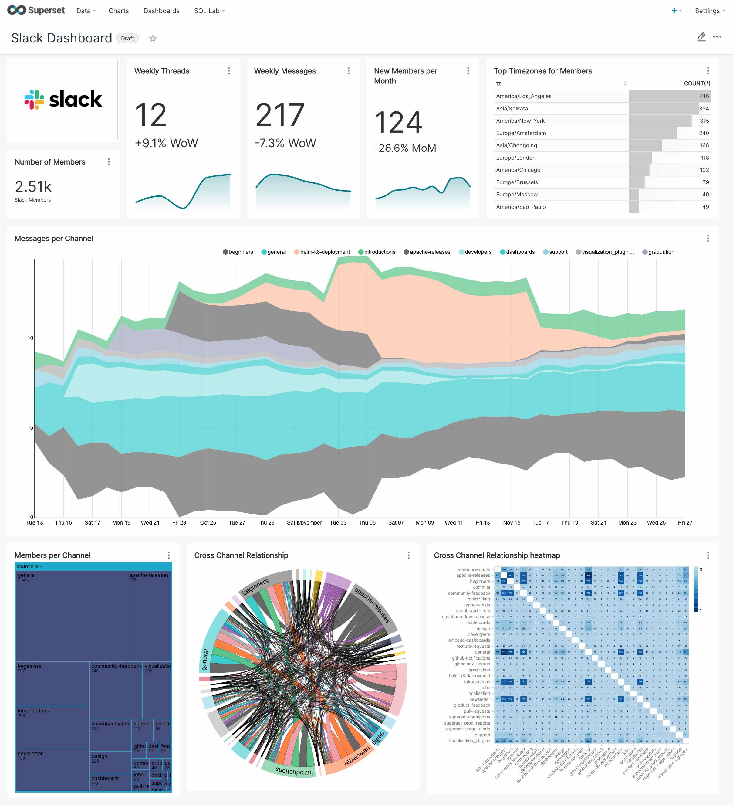

# Apache SuperSet

  http://www.apache.org/licenses/LICENSE-2.0

## Development
docker-compose up
### Prerequisites

```shell
apt install docker
apt install docker-compose git
cd /opt
git clone https://github.com/ursais/superset
```


A modern, enterprise-ready business intelligence web application.

[**Why Superset?**](#why-superset) |
[**Supported Databases**](#supported-databases) |
[**Installation and Configuration**](#installation-and-configuration) |
[**Release Notes**](RELEASING/README.md#release-notes-for-recent-releases) |
[**Get Involved**](#get-involved) |
[**Contributor Guide**](#contributor-guide) |
[**Resources**](#resources) |
[**Organizations Using Superset**](RESOURCES/INTHEWILD.md)

```shell
docker-compose up
```
### Stop
```shell
docker-compose down
```
### Test

```shell
docker-compose run odoo --test-enable --workers=0 --stop-after-init -d <DATABASE NAME>  -i <ADDONS>
```

**View Dashboards**

<kbd></kbd><br/>

**Slice & dice your data**

Report any issue to this
[Github project](https://github.com/ursais/superset-template/issues).
